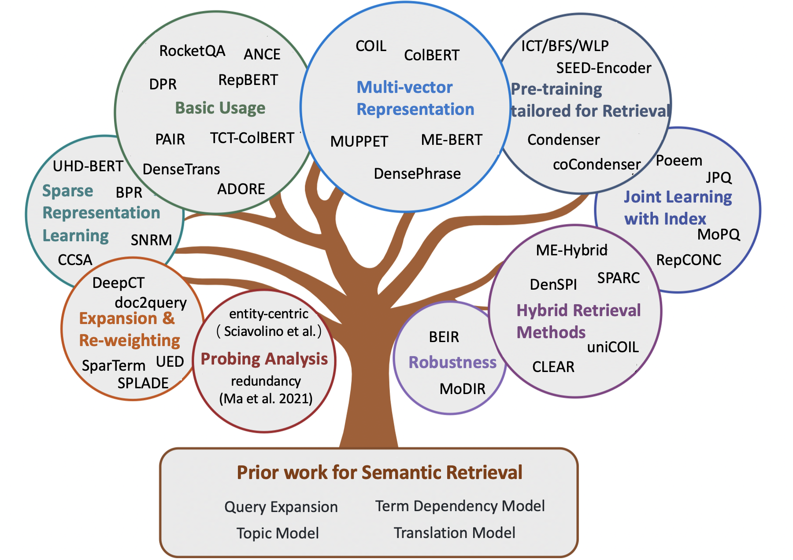

    
<b>Awesome Semantic Models for the First-stage Retrieval</b>

      
   

> Note: 
>
> - A curated list of awesome papers for **[Semantic Retrieval](https://arxiv.org/abs/2103.04831)**, including some early methods and recent neural models for information retrieval tasks (e.g., ad-hoc retrieval, open-domain QA, community-based QA, and automatic conversation).
> - For researchers who want to acquire semantic models for re-ranking stages, we refer readers to the awesome NeuIR survey by *[Guo et.al](https://arxiv.org/abs/1903.06902)*.
> - Any feedback and contribution are welcome, please open an issue or [contact me](mailto:caiyinqiong18s@ict.ac.cn).

## Contents

- [Survey Paper](#survey-paper)
- [Chapter 1: Classical Term-based Retrieval](#classical-term-based-etrieval)
- [Chapter 2: Early Methods for Semantic Retrieval](#early-methods-for-semantic-retrieval)
  - [Query Expansion](#query-expansion)
  - [Document Expansion](#document-expansion)
  - [Term Dependency Model](#term-dependency-model)
  - [Topic Model](#topic-model)
  - [Translation Model](#translation-model)
- [**Chapter 3: Neural Methods for Semantic Retrieval**](#neural-methods-for-semantic-retrieval)
  - [Sparse Retrieval Methods](#sparse-retrieval-methods)
  - [Dense Retrieval Methods](#dense-retrieval-methods)
  - [Hybrid Retrieval Methods](#hybrid-retrieval-methods)
- [Chapter 4: Other Resources](#other-resources)
  - [Other Tasks](#other-tasks)
  - [Datasets](#datasets)
  - [Indexing Methods](#index)

***

## Survey Paper

- [Semantic Matching in Search](https://dl.acm.org/doi/abs/10.1561/1500000035)（Li et al., 2014）
- [Pretrained Transformers for Text Ranking: BERT and Beyond](https://arxiv.org/abs/2010.06467)（Lin et al., 2021, arXiv）
- [**Semantic Models for the First-stage Retrieval: A Comprehensive Review**](https://arxiv.org/pdf/2103.04831.pdf) **（Guo et al., 2021, TOIS）**
- [A Proposed Conceptual Framework for a Representational Approach to Information Retrieval](https://arxiv.org/pdf/2110.01529.pdf)（Lin et al., 2021, arXiv）

## Classical Term-based Retrieval

- [A Vector Space Model for Automatic Indexing](https://dl.acm.org/doi/pdf/10.1145/361219.361220?casa_token=6DLRaJE7vXAAAAAA:EBd4ds5a5xnwx4xK3NJBFcJc0L-bV_leUMaZLMoeh9Bo7ws8ziHhAXv0eUjcIGFV2PHxN-xMIKWayg)（1975, **VSM**）
- [Developments in Automatic Text Retrieval](https://science.sciencemag.org/content/253/5023/974)（1991, **TFIDF**）
- [Term-weighting Approaches in Automatic Text Retrieval](https://www.sciencedirect.com/science/article/abs/pii/0306457388900210)（1988, **TFIDF**）
- [Relevance Weighting of Search Terms](https://asistdl.onlinelibrary.wiley.com/doi/abs/10.1002/asi.4630270302)（1976, **BIM**）
- [A Theoretical Basis for the Use of Co-occurrence Data in Information Retrieval](https://www.emerald.com/insight/content/doi/10.1108/eb026637/full/html)（1997, **Tree Dependence Model**）
- [The Probabilistic Relevance Framework: BM25 and Beyond](https://books.google.com/books?hl=zh-CN&lr=&id=yK6HxUEaZ9gC&oi=fnd&pg=PA1&dq=The+probabilistic+relevance+framework:+BM25+and+beyond&ots=cQn5bjy7qx&sig=toW262ZrGvCswV_ltDGBC7draDU#v=onepage&q=The%20probabilistic%20relevance%20framework%3A%20BM25%20and%20beyond&f=false)（2010, **BM25**）
- [A Language Modeling Approach to Information Retrieval](https://dl.acm.org/doi/pdf/10.1145/290941.291008?casa_token=bUNLYawv-FUAAAAA:mnl3PY6G8-CVSbW76gzX2TW08jrvgWkAhfvMRUKL0FdgMezGLxChZTAD-VhNE0LN7jX0-6OSfi5Fyw)（1998, **QL**）
- [Statistical Language Models for Information Retrieval](https://www.morganclaypool.com/doi/abs/10.2200/S00158ED1V01Y200811HLT001)（2007, **LM for IR**）
- [Hypergeometric Language Model and Zipf-Like Scoring Function for Web Document Similarity Retrieval](https://link.springer.com/chapter/10.1007/978-3-642-16321-0_32)（2010, **LM for IR**）
- [Probabilistic Models of Information Retrieval Based on Measuring the Divergence from Randomness](https://dl.acm.org/doi/pdf/10.1145/582415.582416)（2002, **DFR**）

## Early Methods for Semantic Retrieval

### Query Expansion

- **Global Model**
  - [Word-word Associations in Document Retrieval Systems](https://asistdl.onlinelibrary.wiley.com/doi/abs/10.1002/asi.4630200106)（1969）
  - [Concept based Query Expansion](https://dl.acm.org/doi/pdf/10.1145/160688.160713)（1993）
  - [Query Expansion using Lexical-Semantic Relations](https://link.springer.com/chapter/10.1007/978-1-4471-2099-5_7)（1994）
  - [Using Query Contexts in Information Retrieval](https://dl.acm.org/doi/pdf/10.1145/1277741.1277747)（2007）
- **Local Model**
  - [Relevance Feedback in Information Retrieval]()（1971, **Rocchio PRF**）
  - [Model-based Feedback in the Language Modeling Approach to Information Retrieval](https://dl.acm.org/doi/pdf/10.1145/502585.502654)（2001, **Divergence Minimization Model**）
  - [UMass at TREC 2004: Novelty and HARD](https://scholarworks.umass.edu/cgi/viewcontent.cgi?article=1185&context=cs_faculty_pubs)（2004, **RM3 for PRF**）
  - [Selecting Good Expansion Terms for Pseudo-Relevance Feedback](https://dl.acm.org/doi/pdf/10.1145/1390334.1390377)（2008, PRF）
  - [A Comparative Study of Methods for Estimating Query Language Models with Pseudo Feedback](https://dl.acm.org/doi/pdf/10.1145/1645953.1646259)（2009）
  - [Pseudo-Relevance Feedback Based on Matrix Factorization](https://dl.acm.org/doi/pdf/10.1145/2983323.2983844)（2016）
  - [Reducing the Risk of Query Expansion via Robust Constrained Optimization](https://dl.acm.org/doi/pdf/10.1145/1645953.1646059)（2009，**query drift problem**）
- [Query Expansion using Local and Global Document Analysis](https://dl.acm.org/doi/pdf/10.1145/3130348.3130364)（2017）

### Document Expansion

- [Corpus Structure, Language Models, and Ad Hoc Information Retrieval](https://dl.acm.org/doi/pdf/10.1145/1008992.1009027)（2004）
- [Cluster-Based Retrieval Using Language Models](https://dl.acm.org/doi/pdf/10.1145/1008992.1009026)（2004）
- [Language Model Information Retrieval with Document Expansion](https://aclanthology.org/N06-1052.pdf)（2006）
- [Document Expansion Based on WordNet for Robust IR](https://aclanthology.org/C10-2002.pdf)（2010）
- [Improving Retrieval of Short Texts Through Document Expansion](https://dl.acm.org/doi/pdf/10.1145/2348283.2348405)（2012）
- [Document Expansion Using External Collections](https://dl.acm.org/doi/pdf/10.1145/3077136.3080716)（2017, **WordNet-based**）
- [Document Expansion versus Query Expansion for Ad-hoc Retrieval](http://citeseerx.ist.psu.edu/viewdoc/download?doi=10.1.1.61.5571&rep=rep1&type=pdf)（2005）

### Term Dependency Model

- [Experiments in Automatic Phrase Indexing For Document Retrieval: A Comparison of Syntactic and Non-Syntactic Methods](https://www.proquest.com/openview/94f58af398638882ce784a030bf5c558/1?pq-origsite=gscholar&cbl=18750&diss=y)（1987, **VSM + term dependency**）
- [Term-weighting Approaches in Automatic Text Retrieval](https://www.sciencedirect.com/science/article/abs/pii/0306457388900210)（1988, **VSM + term dependency**）
- [An Analysis of Statistical and Syntactic Phrases](http://www.singhal.info/riao97.pdf)（1997, **VSM + term dependency**）
- [A Probabilistic Model of Information Retrieval: Development and Comparative Experiments](https://www.sciencedirect.com/science/article/abs/pii/S0306457300000169)（2000, **VSM + term dependency**）
- [Relevance Ranking Using Kernels](https://link.springer.com/chapter/10.1007/978-3-642-17187-1_1)（2010, **BM25 + term dependency**）
- [A General Language Model for Information Retrieval ](https://dl.acm.org/doi/pdf/10.1145/319950.320022)（1999, **LM + term dependency**）
- [Biterm Language Models for Document Retrieval](https://dl.acm.org/doi/pdf/10.1145/564376.564476?casa_token=g4XBXaBMO5EAAAAA:FSomCNOm9l3mg2FquRVSmCHnx14lpJN0Ah0lkBGIpn0CUqgk66V85tqAL5BTbC7hmhhew8vhEFRg)（2002, **LM + term dependency**）
- [Capturing Term Dependencies using a Language Model based on Sentence Trees](https://dl.acm.org/doi/pdf/10.1145/584792.584855)（2002, **LM + term dependency**）
- [Dependence Language Model for Information Retrieval](https://dl.acm.org/doi/pdf/10.1145/1008992.1009024)（2004, **LM + term dependency**）
- [A Generative Theory of Relevance](https://books.google.com/books?hl=zh-CN&lr=&id=pQ6h1Yz9oykC&oi=fnd&pg=PA1&dq=A+generative+theory+of+relevance&ots=_apNyA0auQ&sig=hzY0QDSTr9CrYbTRTYXD_tsMx6U#v=onepage&q=A%20generative%20theory%20of%20relevance&f=false)（2008）
- [A Markov Random Field Model for Term Dependencies](https://dl.acm.org/doi/pdf/10.1145/1076034.1076115)（2005, **SDM**）

### Topic Model

- [Generalized Vector Space Model In Information Retrieval](https://dl.acm.org/doi/pdf/10.1145/253495.253506)（1985, **GVSM**）
- [Indexing by Latent Semantic Analysis](https://asistdl.onlinelibrary.wiley.com/doi/abs/10.1002/(SICI)1097-4571(199009)41:6%3C391::AID-ASI1%3E3.0.CO;2-9)（1990, **LSI for IR**）
- [Probabilistic Latent Semantic Indexing](https://dl.acm.org/doi/pdf/10.1145/312624.312649?casa_token=7XwmJlApc80AAAAA:RM5pkFN1FYzICP1ZbSaj8ADlRxUY_x7g5nwOTpc7hFqOX2_QsYafNJ4Q7VN4fnens87w_j7L5wvR)（2017, **PLSA, linearly combine**）
- [Corpus Structure, Language Models, and Ad Hoc Information Retrieval](https://dl.acm.org/doi/pdf/10.1145/1008992.1009027)（2004, **smoothing**)
- [Regularizing Ad Hoc Retrieval Scores](https://dl.acm.org/doi/pdf/10.1145/1099554.1099722)（2005, **smoothing**）
- [LDA-Based Document Models for Ad-Hoc Retrieval](https://dl.acm.org/doi/pdf/10.1145/1148170.1148204)（2006, **LDA for IR and LDA for LM smoothing**）
- [A Comparative Study of Utilizing Topic Models for Information Retrieval](https://link.springer.com/chapter/10.1007/978-3-642-00958-7_6)（2009, **smoothing**）
- [Investigating Task Performance of Probabilistic Topic Models: An Empirical Study of PLSA and LDA](https://link.springer.com/article/10.1007/s10791-010-9141-9)（2010）
- [Latent Semantic Indexing (LSI) Fails for TREC Collections](https://dl.acm.org/doi/pdf/10.1145/1964897.1964900)（2011）

### Translation Model

- [Information Retrieval as Statistical Translation](https://dl.acm.org/doi/pdf/10.1145/3130348.3130371)（1999）
- [Estimation of Statistical Translation Models Based on Mutual Information for Ad Hoc Information Retrieval](https://dl.acm.org/doi/pdf/10.1145/1835449.1835505)（2010）
- [Clickthrough-Based Translation Models for Web Search: From Word Models to Phrase Models](https://dl.acm.org/doi/pdf/10.1145/1871437.1871582)（2010）
- [Axiomatic Analysis of Translation Language Model for Information Retrieval](https://link.springer.com/chapter/10.1007/978-3-642-28997-2_23)（2012）
- [Query Rewriting Using Monolingual Statistical Machine Translation](https://watermark.silverchair.com/coli_a_00010.pdf?token=AQECAHi208BE49Ooan9kkhW_Ercy7Dm3ZL_9Cf3qfKAc485ysgAAAsAwggK8BgkqhkiG9w0BBwagggKtMIICqQIBADCCAqIGCSqGSIb3DQEHATAeBglghkgBZQMEAS4wEQQMVRPWjEXEOlOmEffWAgEQgIICc4KGr_VC0hYGO5dt-b73nOgVFWgTKA_ag9PwLVsG_tT8CaHn8Z_w5cRnF2SMKozw24Bwo0qfEaHATtgLiFJWzV-gDjlWAZ_5UOcwg7mFH1WTWXQcQuTfmhyFgEIWL-5h2BTSdywJp5BPLL8MuuhxRnsQTZcrg55nVXf_DPmd--Q7wtEJZbaf9Hu9ec3GoaD8nVKX2dU8uPVY-QtuqaJR9NICNb7rnGGSyfkJU_a9978VltWxUzXa0dqVA-Us4XwqVEwnac3VuXp57HIVnvnFA1QYlqJ2XoFRagAD0ayGJKSwJoNoZBt51n3kaelhFzx-VlLMpbNvLL3Ju9kIEIoxw1tXclZ_RKO8_AYnjrA7swxHAfzMyTiRap4wuNVwTP7ihog6G0igesb13FxnAEm42QQKGTByI1V76QH0bRcuqmKKNTUB1bQgXJKKtpRFsir-OXv_3mTiAogZxx2ID2cHBOWl97lsim-FYn_Ru-zRzffzyO_YDo9mbuVQk-yu0jMXtt_wTf2aLg4fDLwIkFOk5mblZZiLGyR7NzshENK-4-V25iHNcgqxycmtec5gTq7MHQhoLE9uexe0VZ_KVghilCHS6GuTKa1w6kbObAe_aAGkgSjlda9GKGUf3dhzUJHS4YP4JPmg-9SmP035ybc5xMuODR3gLno-m1mYe7nuxqVyWMl9-7fX_4a2wsaS57jhfKmnzzHynTcWsuw33serRn6W09un-5oEKKPj4V1BUXnJEHVqiWhoi3C4U_RRgMJoyL6CMh7f4nz_pgIbsrc-q6tq7znucehc6wVCumsgH1XEDK7JQUCtUhsOxponhu-xmOSTdw)（2010, **for query expansion**）
- [Towards Concept-based Translation Models using Search Logs for Query Expansion](https://dl.acm.org/doi/pdf/10.1145/2396761.2530275)（2012, **for query expansion**）

## Neural Methods for Semantic Retrieval
### Sparse Retrieval Methods

- **Term Re-weighting**
  - [Learning to Reweight Terms with Distributed Representations](https://dl.acm.org/doi/pdf/10.1145/2766462.2767700)（Zheng et al., 2015, SIGIR, **DeepTR**）
  - [Integrating and Evaluating Neural Word Embeddings in Information Retrieval](https://dl.acm.org/doi/pdf/10.1145/2838931.2838936)（Zuccon et al., 2015, ADCS, **NTLM**）
  - [Learning Term Discrimination](https://dl.acm.org/doi/pdf/10.1145/3397271.3401211)（Frej et al, 2020, SIGIR, **TVD**）
  - [Context-Aware Sentence/Passage Term Importance Estimation for First Stage Retrieval](https://arxiv.org/pdf/1910.10687.pdf)（Dai et al., 2019, arXiv, **DeepCT**）
  - [Context-Aware Term Weighting For First-Stage Passage Retrieval](https://dl.acm.org/doi/pdf/10.1145/3397271.3401204)（Dai et al., 2020, SIGIR, **DeepCT**）
  - [Efficiency Implications of Term Weighting for Passage Retrieval](https://dl.acm.org/doi/pdf/10.1145/3397271.3401263)（Mackenzie et al., 2020, SIGIR, **DeepCT**）
  - [Context-Aware Document Term Weighting for Ad-Hoc Search](https://dl.acm.org/doi/pdf/10.1145/3366423.3380258)（Dai et al., 2020, WWW, **HDCT**）
  - [A Few Brief Notes on DeepImpact, COIL, and a Conceptual Framework for Information Retrieval Techniques](https://arxiv.org/pdf/2106.14807.pdf)（Lin et al., 2021, arXiv, **uniCOIL**）
  
- **Expansion**
  - [Document Expansion by query Prediction](https://arxiv.org/pdf/1904.08375.pdf)（Nogueira et al., 2019, arXiv, **Doc2Query**）
  - [From doc2query to docTTTTTquery](https://cs.uwaterloo.ca/~jimmylin/publications/Nogueira_Lin_2019_docTTTTTquery-v2.pdf)（Nogueira et al., 2019, arXiv, **DocTTTTTQuery**）
  - [A Unified Pretraining Framework for Passage Ranking and Expansion](https://ojs.aaai.org/index.php/AAAI/article/view/16584)（Yan et al., 2021, AAAI, **UED**）
  - [Generation-augmented Retrieval for Open-domain Question Answering](https://aclanthology.org/2021.acl-long.316.pdf)（Mao et al., 2020, ACL, **GAR**, **query expansion**）
- **Expansion + Term Re-weighting**
  - [Expansion via Prediction of Importance with Contextualization](https://dl.acm.org/doi/pdf/10.1145/3397271.3401262)（MacAvaney et al., 2020, SIGIR, **EPIC**）
  - [SparTerm: Learning Term-based Sparse Representation for Fast Text Retrieval](https://arxiv.org/pdf/2010.00768.pdf)（Bai et al., 2020, arXiv, **SparTerm**）
  - [SPLADE: Sparse Lexical and Expansion Model for First Stage Ranking](https://dl.acm.org/doi/pdf/10.1145/3404835.3463098)（Formal et al., 2021, SIGIR, **SPLADE**）
  - [SPLADE v2: Sparse Lexical and Expansion Model for Information Retrieval](https://arxiv.org/pdf/2109.10086.pdf)（Formal et al., 2021, arXiv, **SPLADEv2**）
  - [Learning Passage Impacts for Inverted Indexes](https://dl.acm.org/doi/pdf/10.1145/3404835.3463030)（Mallia et al., 2021, SIGIR, **DeepImapct**）
  - [TILDE: Term Independent Likelihood moDEl for Passage Re-ranking](http://ielab.io/publications/pdfs/arvin2021tilde.pdf)（Zhuang et al., 2021, SIGIR, **TILDE**）
  - [Fast Passage Re-ranking with Contextualized Exact Term Matching and Efficient Passage Expansion](https://arxiv.org/pdf/2108.08513.pdf)（Zhuang et al., 2021, arXiv, **TILDEv2**）
- **Sparse Representation Learning**
  - [Semantic Hashing](https://reader.elsevier.com/reader/sd/pii/S0888613X08001813?token=DC834E84448C134BC820C604CD63095AD2736144D81932A2E4EF5080206926924B21983C3254D232BB02587EDBC6F1AE&originRegion=us-east-1&originCreation=20210806113324)（Salakhutdinov et al., 2009）
  - [From Neural Re-Ranking to Neural Ranking: Learning a Sparse Representation for Inverted Indexing](https://dl.acm.org/doi/pdf/10.1145/3269206.3271800)（Zamani et al., 2018, CIKM, **SNRM**）
  - [UHD-BERT: Bucketed Ultra-High Dimensional Sparse Representations for Full Ranking](https://arxiv.org/pdf/2104.07198.pdf)（Jang et al., 2021, arXiv, **UHD-BERT**）
  - [Efficient Passage Retrieval with Hashing for Open-domain Question Answering](https://arxiv.org/pdf/2106.00882.pdf)（Yamada et al., 2021, ACL, **BPR**）
  - [Composite Code Sparse Autoencoders for First Stage Retrieval](https://dl.acm.org/doi/pdf/10.1145/3404835.3463066?casa_token=MPKX0sQEXTgAAAAA:DeX2RpvQpfS_8wpW1DfHvfeMtQjglVIkp84o4N-ZZPGiUbUQqMllfxWS2E8SYzKLGLWyz_eI9L0-)（Lassance et al., 2021, SIGIR, **CCSA**）

### Dense Retrieval Methods

- **Word-Embedding-based**
  - [Aggregating Continuous Word Embeddings for Information Retrieval](https://aclanthology.org/W13-3212.pdf)（Clinchant et al., 2013, ACL, **FV**）
  - [Monolingual and Cross-Lingual Information Retrieval Models Based on (Bilingual) Word Embeddings](https://dl.acm.org/doi/pdf/10.1145/2766462.2767752)（Vulic et al., 2015, SIGIR）
  - [Short Text Similarity with Word Embeddings](https://dl.acm.org/doi/pdf/10.1145/2806416.2806475)（Kenter et al., 2015, CIKM, **OoB**）
  - [A Dual Embedding Space Model for Document Ranking](https://arxiv.org/pdf/1602.01137.pdf)（Mitra et al., 2016, arXiv, **DESM**）
  - [Efficient Natural Language Response Suggestion for Smart Reply](https://arxiv.org/pdf/1705.00652.pdf)（Henderson et al., 2017, arXiv）
  - [End-to-End Retrieval in Continuous Space](https://arxiv.org/pdf/1811.08008.pdf)（Gillick et al., 2018, arXiv）
  
- [Phrase-Indexed Question Answering: A New Challenge for Scalable Document Comprehension](https://arxiv.org/pdf/1804.07726.pdf)（Seo et al., 2018, EMNLP, **PIQA**）

- [Dense Passage Retrieval for Open-Domain Question Answering](https://arxiv.org/pdf/2004.04906.pdf)（Karpukhin et al., 2020, EMNLP, **DPR**）

- [Retrieval-augmented generation for knowledge-intensive NLP tasks](https://arxiv.org/pdf/2005.11401.pdf)（Lewis et al., 2020, NIPS, **RAG**）

- [RepBERT: Contextualized Text Embeddings for First-Stage Retrieval](https://arxiv.org/pdf/2006.15498.pdf)（Zhan et al., 2020, arXiv, **RepBERT**）

- [CoRT: Complementary Rankings from Transformers](https://aclanthology.org/2021.naacl-main.331.pdf)（Wrzalik et al., 2020, NAACL, **CoRT**）

- [DC-BERT: Decoupling Question and Document for Efficient Contextual Encoding](https://dl.acm.org/doi/pdf/10.1145/3397271.3401271)（Nie et al., 2020, SIGIR, **DC-BERT**）

- [Neural Retrieval for Question Answering with Cross-Attention Supervised Data Augmentation](https://arxiv.org/pdf/2009.13815.pdf)（Yang et al., 2021, ACL, **data augmentation**）

- [Approximate Nearest Neighbor Negative Contrastive Learning for Dense Text Retrieval](https://arxiv.org/pdf/2007.00808.pdf)（Xiong et al., 2020, arXiv, **ANCE**）

- [Learning To Retrieve: How to Train a Dense Retrieval Model Effectively and Efficiently](https://arxiv.org/pdf/2010.10469.pdf)（Zhan et al., 2020, arXiv, **LTRe**）

- [GLOW : Global Weighted Self-Attention Network for Web](https://arxiv.org/pdf/2007.05186.pdf)（Shan et al, 2020, arXiv, **GLOW**）

- [An Optimized Training Approach to Dense Passage Retrieval for Open-Domain Question Answering](https://aclanthology.org/2021.naacl-main.466.pdf)（Qu et al., 2021, ACL, **RocketQA**）

- [Efficiently Teaching an Effective Dense Retriever with Balanced Topic Aware Sampling](https://arxiv.org/pdf/2104.06967.pdf)（Hofstätter et al., 2021, SIGIR, **TAS-Balanced**）

- [Optimizing Dense Retrieval Model Training with Hard Negatives](https://arxiv.org/pdf/2104.08051.pdf)（Zhan et al., 2021, SIGIR, **STAR/ADORE**）

- [Few-Shot Conversational Dense Retrieval](https://arxiv.org/pdf/2105.04166.pdf)（Yu et al., 2021, SIGIR）

- [Learning Dense Representations of Phrases at Scale](https://arxiv.org/pdf/2012.12624.pdf)（Lee et al., 2021, ACL, **DensePhrases**）

- [More Robust Dense Retrieval with Contrastive Dual Learning](https://arxiv.org/pdf/2107.07773.pdf)（Lee et al., 2021, ICTIR, **DANCE**）

- [PAIR: Leveraging Passage-Centric Similarity Relation for Improving Dense Passage Retrieval](https://aclanthology.org/2021.findings-acl.191.pdf)（Ren et al., 2021, ACL, **PAIR**）

- [Relevance-guided Supervision for OpenQA with ColBERT](https://arxiv.org/pdf/2007.00814.pdf)（Khattab et al., 2021, TACL, **ColBERT-QA**）

- [End-to-End Training of Multi-Document Reader and Retriever for Open-Domain Question Answering](https://arxiv.org/pdf/2106.05346.pdf)（Sachan et al., 2021, arXiv, **EMDR^2​**）

- [Improving Query Representations for Dense Retrieval with Pseudo Relevance Feedback](https://arxiv.org/pdf/2108.13454.pdf)（Yu et al, 2021, CIKM, **ANCE-PRF**）

- [Pseudo-Relevance Feedback for Multiple Representation Dense Retrieval](https://arxiv.org/pdf/2106.11251.pdf)（Wang et al., 2021, ICTIR, **ColBERT-PRF**）

- [A Discriminative Semantic Ranker for Question Retrieval](https://arxiv.org/pdf/2107.08345.pdf)（Cai et al., 2021, ICTIR, **DenseTrans**）

- [Representation Decoupling for Open-Domain Passage Retrieval](https://arxiv.org/pdf/2110.07524.pdf)（Wu et al., 2021, arXiv）

- [RocketQAv2: A Joint Training Method for Dense Passage Retrieval and Passage Re-ranking](https://arxiv.org/pdf/2110.07367.pdf)（Ren et al., 2021, EMNLP, **RocketQAv2**）

- Efficient Training of Retrieval Models Using Negative Cache（NIPS2021）

- **Knowledge Distillation**
  - [Distilling Dense Representations for Ranking using Tightly-Coupled Teachers](https://arxiv.org/pdf/2010.11386.pdf)（Lin et al., 2020, arXiv, **TCT-ColBERT**）
  - [Distilling Knowledge for Fast Retrieval-based Chat-bots](https://dl.acm.org/doi/pdf/10.1145/3397271.3401296)（Tahami et al., 2020, SIGIR）
  - [Distilling Knowledge from Reader to Retriever for Question Answering](https://arxiv.org/pdf/2012.04584.pdf)（Izacard et al., 2020, arXiv）
  - [Is Retriever Merely an Approximator of Reader?](https://arxiv.org/pdf/2010.10999.pdf)（Yang et al., 2020, arXiv）
  - Twinbert: Distilling knowledge to twin-structured compressed bert models for large-scale retrieval.
  - [Improving Bi-encoder Document Ranking Models with Two Rankers and Multi-teacher Distillation](https://arxiv.org/pdf/2103.06523.pdf)（Choi et al., 2021, SIGIR, **TRMD**）
  - [Improving Efficient Neural Ranking Models with Cross-Architecture Knowledge Distillation](https://arxiv.org/pdf/2010.02666.pdf)（Hofstätter et al., 2021, arXiv, **Margin-MSE loss**）
  
- **Multi-vector Representation** 
  - [Multi-Hop Paragraph Retrieval for Open-Domain Question Answering](https://arxiv.org/pdf/1906.06606.pdf)（Feldman et al., 2019, ACL, **MUPPET**）
  - [Sparse, Dense, and Attentional Representations for Text Retrieval](https://arxiv.org/pdf/2005.00181.pdf)（Luan et al., 2020, TACL, **ME-BERT**）
  - [ColBERT: Efficient and Effective Passage Search via Contextualized Late Interaction over BERT](https://dl.acm.org/doi/pdf/10.1145/3397271.3401075)（Khattab et al., 2020, SIGIR, **ColBERT**）
  - [COIL: Revisit Exact Lexical Match in Information Retrieval with Contextualized Inverted List](https://arxiv.org/pdf/2104.07186.pdf)（Gao et al., 2021, NACL, **COIL**）
  - [Improving Document Representations by Generating Pseudo Query Embeddings for Dense Retrieval](https://arxiv.org/pdf/2105.03599.pdf)（Tang et al., 2021, ACL）
  - [Phrase Retrieval Learns Passage Retrieval, Too](https://arxiv.org/pdf/2109.08133.pdf)（Lee et al., 2021, EMNLP, **DensePhrases**）
  - [Query Embedding Pruning for Dense Retrieval](https://arxiv.org/abs/2108.10341)（Tonellotto et al., 2021, CIKM）
  
- **Accelerate Interaction-based Models**
  - [Incorporating Query Term Independence Assumption for Efficient Retrieval and Ranking using Deep Neural Networks](https://arxiv.org/pdf/1907.03693.pdf)（Mitra et al., 2019, arXiv）
  - [Efficient Interaction-based Neural Ranking with Locality Sensitive Hashing](https://dl.acm.org/doi/pdf/10.1145/3308558.3313576)（Ji et al., 2019, WWW）
  - [Poly-encoders: Architectures and Pre-training Strategies for Fast and Accurate Multi-sentence Scoring](https://arxiv.org/pdf/1905.01969.pdf)（Humeau et al., 2020, ICLR, **Poly-encoders**）
  -  [Modularized Transfomer-based Ranking Framework](https://arxiv.org/pdf/2004.13313.pdf)（Gao et al., 2020, EMNLP, **MORES**）
  - [Efficient Document Re-Ranking for Transformers by Precomputing Term Representations](https://dl.acm.org/doi/pdf/10.1145/3397271.3401093)（MacAvaney et al., 2020, SIGIR, **PreTTR**）
  - [DeFormer: Decomposing Pre-trained Transformers for Faster Question Answering](https://arxiv.org/pdf/2005.00697.pdf)（Cao et al., 2020, ACL, **DeFormer**）
  - [SPARTA: Efficient Open-Domain Question Answering via Sparse Transformer Matching Retrieval](https://arxiv.org/pdf/2009.13013.pdf)（Zhao et al., 2020, arXiv, **SPARTA**）
  - [Conformer-Kernel with Query Term Independence for Document Retrieval](https://arxiv.org/pdf/2007.10434.pdf)（Mitra et al., 2020, arXiv）
  
- **Pre-training**
  - [Latent Retrieval for Weakly Supervised Open Domain Question Answering](https://arxiv.org/pdf/1906.00300.pdf)（Lee et al., 2019, ACL, **ORQA**）
  - [Retrieval-Augmented Language Model Pre-Training](http://proceedings.mlr.press/v119/guu20a/guu20a.pdf)（Guu et al., 2020, ICML, **REALM**）
  - [Pre-training Tasks for Embedding-based Large-scale Retrieval](https://arxiv.org/pdf/2002.03932.pdf)（Chang et al., 2020, ICLR, **BFS+WLP+MLM**）
  - [Embedding-based Zero-shot Retrieval through Query Generation](https://arxiv.org/pdf/2009.10270.pdf)（Liang et al., 2020, arXiv, **query generation**）
  - [Zero-shot Neural Passage Retrieval via Domain-targeted Synthetic Question Generation](https://arxiv.org/pdf/2004.14503.pdf)（Ma et al., 2020, arXiv, **query generation**）
  - [Towards Robust Neural Retrieval Models with Synthetic Pre-Training](https://arxiv.org/pdf/2104.07800.pdf)（Reddy et al., 2021, arXiv, **query generation**）
  - [Is Your Language Model Ready for Dense Representation Fine-tuning?](https://arxiv.org/pdf/2104.08253.pdf)（Gao et al., 2021, EMNLP, **Condenser**）
  - [Unsupervised Corpus Aware Language Model Pre-training for Dense Passage Retrieval](https://arxiv.org/abs/2108.05540)（Gao et al., 2021, arXiv, **coCondenser**）
  - [Less is More: Pre-training a Strong Siamese Encoder Using a Weak Decoder](https://arxiv.org/pdf/2102.09206.pdf)（Lu et al., 2021, EMNLP, **SEED-Encoder**）
  - [Pre-trained Language Model for Web-scale Retrieval in Baidu Search](https://arxiv.org/pdf/2106.03373.pdf)（Liu et al., 2021, KDD）
  - [Pre-training for Ad-hoc Retrieval: Hyperlink is Also You Need](http://playbigdata.ruc.edu.cn/dou/publication/2021_CIKM_Pretraining.pdf)（Ma et al., 2021, CIKM, **HARP**）
  
- **Joint Learning with Index**
  - [Joint Learning of Deep Retrieval Model and Product Quantization based Embedding Index](https://arxiv.org/pdf/2105.03933.pdf)（Zhang et al., 2021, SIGIR, **Poeem**）
  - [Jointly Optimizing Query Encoder and Product Quantization to Improve Retrieval Performance](https://arxiv.org/pdf/2108.00644.pdf)（Zhan et al., 2021, CIKM, **JPQ**）
  - [Matching-oriented Product Quantization For Ad-hoc Retrieval](https://arxiv.org/pdf/2104.07858.pdf)（Xiao et al., 2021, EMNLP, **MoPQ**）
  - [Learning Discrete Representations via Constrained Clustering for Effective and Efficient Dense Retrieval](https://arxiv.org/pdf/2110.05789)（Zhan et al, 2022, WSDM, **RepCONC**）
  
- **Debias**
  - [Learning Robust Dense Retrieval Models from Incomplete Relevance Labels](https://dl.acm.org/doi/pdf/10.1145/3404835.3463106?casa_token=o7uvhY_qcJgAAAAA:m5tqKfk2x4HNcucL2iL5oMclriEuEZ-O_k7sy8UcJiAWe493HIFg6OeJv-kG7DQEMcoCjZEyhEP3Mg)（Prakash et al., 2021, SIGIR, **RANCE**）
  
- **Zero-shot**
  
  - [BEIR: A Heterogeneous Benchmark for Zero-shot Evaluation of Information Retrieval Models](https://arxiv.org/pdf/2104.08663.pdf)（ Thakur et al., 2021, NeurIPS, **transferability**）
  
  - [Zero-Shot Dense Retrieval with Momentum Adversarial Domain Invariant Representations](https://arxiv.org/pdf/2110.07581.pdf)（Xin et al., 2021, arXiv, **MoDIR**）
  - [Large Dual Encoders Are Generalizable Retrievers](https://arxiv.org/pdf/2112.07899.pdf)（Ni et al., 2021, arXiv, **DTR**）
  
- **Probing Analysis**
  
  - [The Curse of Dense Low-Dimensional Information Retrieval for Large Index Sizes](https://arxiv.org/abs/2012.14210)（Reimers et al., 2021, ACL）
  - [Simple and Effective Unsupervised Redundancy Elimination to Compress Dense Vectors for Passage Retrieval](https://cs.uwaterloo.ca/~jimmylin/publications/Ma_etal_EMNLP2021.pdf)（Ma et al., EMNLP, 2021, **redundancy**）
  - [BEIR: A Heterogeneous Benchmark for Zero-shot Evaluation of Information Retrieval Models](https://arxiv.org/pdf/2104.08663.pdf)（ Thakur et al., 2021, NeurIPS, **transferability**）
  - [Salient Phrase Aware Dense Retrieval: Can a Dense Retriever Imitate a Sparse One?](https://arxiv.org/pdf/2110.06918.pdf)（Chen et al., 2021, arXiv）
  - [Simple Entity-Centric Questions Challenge Dense Retrievers](https://arxiv.org/pdf/2109.08535.pdf)（Sciavolino et al., 2021, EMNLP）

### Hybrid Retrieval Methods

- **Word-Embedding-based**
  - [Monolingual and Cross-Lingual Information Retrieval Models Based on (Bilingual) Word Embeddings](https://dl.acm.org/doi/pdf/10.1145/2766462.2767752)（Vulic et al., 2015, SIGIR, **linearly combine**）
  - [Word Embedding based Generalized Language Model for Information Retrieval](https://dl.acm.org/doi/pdf/10.1145/2766462.2767780)（Ganguly et al., 2015, SIGIR, **GLM**）
  - [Representing Documents and Queries as Sets of Word Embedded Vectors for Information Retrieval](https://arxiv.org/pdf/1606.07869.pdf)（Roy et al., 2016, SIGIR, **linearly combine**）
  - [A Dual Embedding Space Model for Document Ranking](https://arxiv.org/pdf/1602.01137.pdf)（Mitra et al., 2016, WWW, **DESM_mixture**, **linearly combine**）
  - [Off the Beaten Path: Let’s Replace Term-Based Retrieval with k-NN Search](https://dl.acm.org/doi/pdf/10.1145/2983323.2983815)（Boytsov et al., 2016, CIKM, **BM25+translation model**）
- [Learning Hybrid Representations to Retrieve Semantically Equivalent Questions](https://aclanthology.org/P15-2114.pdf)（Santos et al., 2015, ACL, **BOW-CNN**）
- [Real-Time Open-Domain Question Answering with Dense-Sparse Phrase Index](https://arxiv.org/pdf/1906.05807.pdf) （Seo et al., 2019, ACL, **DenSPI**）
- [Contextualized Sparse Representations for Real-Time Open-Domain Question Answering](https://arxiv.org/pdf/1911.02896.pdf)（Lee et al., 2020, ACL, **SPARC**）
- [CoRT: Complementary Rankings from Transformers](https://aclanthology.org/2021.naacl-main.331.pdf)（Wrzalik et al., 2020, NAACL, **CoRT_BM25**）
- [Sparse, Dense, and Attentional Representations for Text Retrieval](https://arxiv.org/pdf/2005.00181.pdf)（Luan et al., 2020, TACL, **ME-Hybrid**）
- [Complement Lexical Retrieval Model with Semantic Residual Embeddings](https://arxiv.org/pdf/2004.13969.pdf)（Gao et al., 2020, ECIR, **CLEAR**）
- [Leveraging Semantic and Lexical Matching to Improve the Recall of Document Retrieval Systems: A Hybrid Approach](https://arxiv.org/pdf/2010.01195.pdf)（Kuzi et al., 2020, arXiv, **Hybrid**）
- [A Few Brief Notes on DeepImpact, COIL, and a Conceptual Framework for Information Retrieval Techniques](https://arxiv.org/pdf/2106.14807.pdf)（Lin et al., 2021, arXiv, **uniCOIL**）
- [Contextualized Offline Relevance Weighting for Efficient and Effective Neural Retrieval](https://dl.acm.org/doi/pdf/10.1145/3404835.3463073)（Chen et al., 2021, SIGIR）
- [Predicting Efficiency/Effectiveness Trade-offs for Dense vs. Sparse Retrieval Strategy Selection](https://arxiv.org/pdf/2109.10739.pdf)（Arabzadeh et al., 2021, CIKM）
- [Fast Forward Indexes for Efficient Document Ranking](https://arxiv.org/pdf/2110.06051.pdf)（Leonhardt et al., 2021, arXiv）
- [Densifying Sparse Representations for Passage Retrieval by Representational Slicing](https://arxiv.org/pdf/2112.04666.pdf)（Lin et al., 2021, arXiv）

## Other Resources
### Other Tasks
- **E-commerce Search**
  - [Deep Interest Network for Click-Through Rate Prediction](https://dl.acm.org/doi/pdf/10.1145/3219819.3219823)（Zhou et al., 2018, KDD, **DIN**）
  - [From Semantic Retrieval to Pairwise Ranking: Applying Deep Learning in E-commerce Search](https://dl.acm.org/doi/pdf/10.1145/3331184.3331434)（Li et al., 2019, SIGIR, Jingdong）
  - [Multi-Interest Network with Dynamic Routing for Recommendation at Tmall](https://dl.acm.org/doi/pdf/10.1145/3357384.3357814)（Li et al., 2019, CIKM, **MIND**, Tmall）
  - [Towards Personalized and Semantic Retrieval: An End-to-End Solution for E-commerce Search via Embedding Learning](https://dl.acm.org/doi/pdf/10.1145/3397271.3401446)（Zhang et al., 2020, SIGIR, **DPSR**, Jingdong）
  - [Deep Multi-Interest Network for Click-through Rate Prediction](https://dl.acm.org/doi/pdf/10.1145/3340531.3412092)（Xiao et al., 2020, CIKM, **DMIN**）
  - [Deep Retrieval: An End-to-End Learnable Structure Model for Large-Scale Recommendations](https://arxiv.org/pdf/2007.07203.pdf)（Gao et al., 2020, arXiv）
  - [Embedding-based Product Retrieval in Taobao Search](https://arxiv.org/pdf/2106.09297.pdf)（Li et al., 2021, KDD, taobao）
  - [Embracing Structure in Data for Billion-Scale Semantic Product Search](https://arxiv.org/pdf/2110.06125.pdf)（Lakshman et al., 2021, arXiv, Amazon）
- **Sponsored Search**
  - [MOBIUS: Towards the Next Generation of Query-Ad Matching in Baidu’s Sponsored Search](https://dl.acm.org/doi/pdf/10.1145/3292500.3330651)（Fan et al., 2019, KDD, Baidu）
- **Image Retrieval**
  - [Binary Neural Network Hashing for Image Retrieval](https://dl.acm.org/doi/pdf/10.1145/3404835.3462896)（Zhang et al., 2021, SIGIR, **BNNH**）
  - [Deep Self-Adaptive Hashing for Image Retrieval](https://arxiv.org/pdf/2108.07094.pdf)（Lin et al., 2021, CIKM, **DSAH**）
- [Report on the First HIPstIR Workshop on the Future of Information Retrieval](https://dl.acm.org/doi/pdf/10.1145/3458553.3458560)（Dietz et al., 2019, SIGIR, workshop）
- [Let’s measure run time! Extending the IR replicability infrastructure to include performance aspects](https://arxiv.org/pdf/1907.04614.pdf)（Hofstätter et al., 2019, SIGIR）
- [Embedding-based Retrieval in Facebook Search](https://dl.acm.org/doi/pdf/10.1145/3394486.3403305)（Huang et al., 2020, KDD, **EBR**）
- [Learning K-way D-dimensional Discrete Codes for Compact Embedding Representations](http://proceedings.mlr.press/v80/chen18g/chen18g.pdf)（Chen et al., 2018, ICML）

### Datasets
- 【MS MARCO】[MS MARCO: A Human Generated MAchine Reading COmprehension Dataset](https://arxiv.org/pdf/1611.09268.pdf)
- 【TREC CAR】[TREC Complex Answer Retrieval Overview](https://trec.nist.gov/pubs/trec26/papers/Overview-CAR.pdf)
- 【TREC DL】[Overview of the TREC 2019 deep learning track](https://arxiv.org/pdf/2003.07820.pdf)
- 【TREC COVID】[TREC-COVID: Constructing a Pandemic Information Retrieval Test Collection](https://dl.acm.org/doi/pdf/10.1145/3451964.3451965)

### Indexing Methods
- **Tree-based**
  - [Multidimensional Binary Search Trees Used for Associative Searching](https://dl.acm.org/doi/pdf/10.1145/361002.361007)（1975, **KD tree**）
  - [Annoy](https://github.com/spotify/annoy)
- **Hashing-based**
  - [Approximate Nearest Neighbors: Towards Removing the Curse of Dimensionality](https://dl.acm.org/doi/pdf/10.1145/276698.276876)（1998, **LSH**）
- **Quantization-based**
  - [Product Quantization for Nearest Neighbor Search](https://ieeexplore.ieee.org/abstract/document/5432202)（2010, **PQ**）
  - [Optimized Product Quantization](https://ieeexplore.ieee.org/abstract/document/6678503)（2013, **OPQ**）
- **Graph-based**
  - [Navigation in a Small World](https://www.nature.com/articles/35022643.pdf)（2000, **NSW**）
  - [Efficient and robust approximate nearest neighbor search using Hierarchical Navigable Small World graphs](https://arxiv.org/pdf/1603.09320.pdf)（2018, **HNSW**）
- **Toolkits**
  - [Faiss: a library for efficient similarity search and clustering of dense vectors](https://github.com/facebookresearch/faiss)
  - [SPTAG: A library for fast approximate nearest neighbor search](https://github.com/microsoft/SPTAG)
  - [OpenMatch: An Open-Source Package for Information Retrieval](https://github.com/thunlp/OpenMatch)
  - [Pyserini: A Python Toolkit for Reproducible Information Retrieval Research with Sparse and Dense Representations](https://github.com/castorini/pyserini)
  - [ElasticSearch](https://github.com/elastic/elasticsearch)

