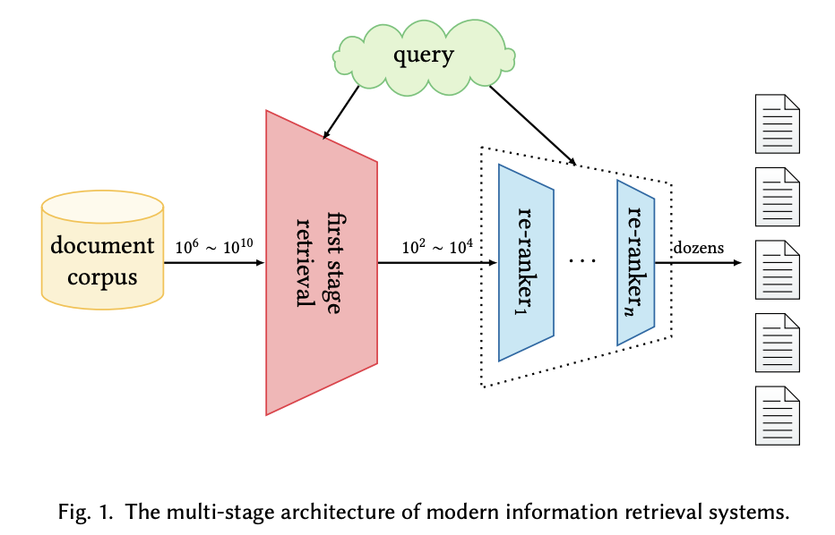

    
<b>Awesome Semantic Models for the First-stage Retrieval</b>

      
   

> Note: 
>
> - A curated list of awesome papers for the **Semantic Retrieval**, including some early methods and recent neural models.
> - For people who want to acquire semantic models for re-ranking stage, we refer readers to the awesome NeuIR survey by *[Guo et.al](https://arxiv.org/abs/1903.06902)*.
> - Any feedback and contribution are welcome, please open an issue or [contact me](mailto:caiyinqiong18s@ict.ac.cn).

## Contents

- [Survey Paper](#survey-paper)
- [Chapter 1: Classical Term-based Retrieval](#classical-term-based-etrieval)
- [Chapter 2: Early Methods for Semantic Retrieval](#early-methods-for-semantic-retrieval)
  - [Query Expansion](#query-expansion)
  - [Document Expansion](#document-expansion)
  - [Term Dependency Model](#term-dependency-model)
  - [Topic Model](#topic-model)
  - [Translation Model](#translation-model)
- [**Chapter 3: Neural Methods for Semantic Retrieval**](#neural-methods-for-semantic-retrieval)
  - [Sparse Retrieval Methods](#sparse-retrieval-methods)
  - [Dense Retrieval Methods](#dense-retrieval-methods)
  - [Hybrid Retrieval Methods](#hybrid-retrieval-methods)
- [Chapter 4: Other Resources](#other-resources)
  - [Other Tasks](#other-tasks)
  - [Datasets](#datasets)
  - [Indexing Methods](#index)

***

## Survey Paper

- [Semantic Matching in Search](https://dl.acm.org/doi/abs/10.1561/1500000035)（Li et al., 2014）
- [Pretrained Transformers for Text Ranking: BERT and Beyond](https://arxiv.org/abs/2010.06467)（Lin et al., 2021, arXiv）
- [Semantic Models for the First-stage Retrieval: A Comprehensive Review](https://arxiv.org/pdf/2103.04831.pdf) (Cai et al., 2021, arXiv)

## Classical Term-based Retrieval

- 【VSM】A vector space model for automatic indexing（1975）
- 【TFIDF】Developments in automatic text retrieval（1991）
- 【TFIDF】Term-weighting approaches in automatic text retrieval.（1988）
- 【BIM】Relevance weighting of search terms（1976）
- 【Probabilistic Model】Relevance weighting of search terms（1977）、Probabilistic models of  indexing and searching（1981）、The unified probabilistic model for ir（1983）、Efficient probabilistic inference for text retrieval（1991）、Some simple effective approximations to the 2-poisson model for probabilistic weighted retrieval（1994）、The Probability Ranking Principle in IR（1997，propose Probability Ranking Principle）、The unified model revisited（2003）、A new unified probabilistic model（2004）
- 【Tree Dependence Model】A theoretical basis for the use of co-occurrence data in information retrieval
- 【BM25】The probabilistic relevance framework: BM25 and beyond（2010）
- 【DFR】Probabilistic models of information retrieval based on measuring the divergence from randomness（2002）
- 【Language Model/QL】A language modeling approach to information retrieval（1998）
- 【Language Model】Statistical language models for information retrieval a critical review（zhai,2007）
- 【Language Model】Hypergeometric language model and Zipf-like scoring function for web document similarity retrieval（2010）

## Early Methods for Semantic Retrieval

### Query Expansion

- Global Model
  - Global analysis often relies on external resources or document collections
  - Concept based query expansion（1993）
  - Word-word associations in document retrieval systems.（1969）
- Local Model
  - 【PRF】Query expansion using lexical-semantic relations.（1994）
  - 【PRF】Selecting good expansion terms for pseudo-relevance feedback.（2008）
  - 【Rocchio PRF】Relevance Feedback in Information Retrieval（1971）
  - A comparative study of methods for estimating query language models with pseudo feedback.（2009）
  - Pseudo-relevance feedback based on matrix factorization（2016）
- 【RM3】Relevance based language models（2001）
- Model-based feedback in the language modeling approach to information retrieval.（2001）
- Query expansion using local and global document analysis.
- Search Engines: Information Retrieval in Practice.（2009）
- Reducing the risk of query expansion via robust constrained optimization（2009，query drift problem）

### Document Expansion

- to do

### Term Dependency Model

- **VSM + term dependency**
  - Experiments in automatic phrase indexing for document retrieval: A comparison of syntactic and non-syntactic methods（1987）
  - An analysis of statistical and syntactic phrases（1997）
  - Term-weighting approaches in automatic text retrieval（1988）
  - A probabilistic model of information retrieval: development and comparative experiments.（2000）
- **BM25 + term dependency**
  - Relevance ranking using kernels.（2010）
- **LM + term dependency**
  - A general language model for information retrieval.（1999）
  - Biterm language models for document retrieval.（2002）
  - Capturing term dependencies using a language model based on sentence trees.（2002）
  - Dependence language model for information retrieval（2004）
- A generative theory of relevance（2004）
- A Markov random field model for term dependencies（2005, **SDM**）

### Topic Model

- 【GVSM】Generalized vector spaces model in information retrieval.（1985）
- 【LSA/LSI】Indexing by latent semantic analysis.（1990）
- 【NMF】Algorithms for non-negative matrix factorization.（2001）
- 【RLSI】Regularized latent semantic indexing（2011）、Group matrix factorization for scalable topic modeling.（2012）
- 【PLSA】Probabilistic latent semantic indexing（1999）
- 【LDA】Latent dirichlet allocation（2003）
- Supervised topic models.（2007）
- Investigating task performance of probabilistic topic models: an empirical study of PLSA and LDA.（2010）
- Corpus structure, language models, and ad hoc information retrieval.（2004，topic model for smoothing)
- Regularizing ad hoc retrieval scores（2005，topic model for smoothing）
- Lda-based document models for ad-hoc retrieval.（2006，LDA for IR and LDA for LM smoothing）
- A comparative study of utilizing topic models for information retrieval.（2009）
- Latent semantic indexing (lsi) fails for trec collections（2011）

### Translation Model

- Information retrieval as statistical translation.（1999）
- Estimation of statistical translation models based on mutual information for ad hoc information retrieval.（2010）
- Axiomatic analysis of translation language model for information retrieval.（2012）
- Language model for information retrieval（2002）

## Neural Methods for Semantic Retrieval
### Sparse Retrieval Methods

- **Term Re-weighting**
  - [Learning to Reweight Terms with Distributed Representations](https://dl.acm.org/doi/pdf/10.1145/2766462.2767700)（Zheng et al., 2015, SIGIR, **DeepTR**）
  - [Integrating and Evaluating Neural Word Embeddings in Information Retrieval](https://dl.acm.org/doi/pdf/10.1145/2838931.2838936)（Zuccon et al., 2015, ADCS, **NTLM**）
  - [Learning Term Discrimination](https://dl.acm.org/doi/pdf/10.1145/3397271.3401211)（Frej et al, 2020, SIGIR, **TVD**）
  - [Context-Aware Sentence/Passage Term Importance Estimation for First Stage Retrieval](https://arxiv.org/pdf/1910.10687.pdf)（Dai et al., 2019, arXiv, **DeepCT**）
  - [Context-Aware Term Weighting For First-Stage Passage Retrieval](https://dl.acm.org/doi/pdf/10.1145/3397271.3401204)（Dai et al., 2020, SIGIR, **DeepCT**）
  - [Efficiency Implications of Term Weighting for Passage Retrieval](https://dl.acm.org/doi/pdf/10.1145/3397271.3401263)（Mackenzie et al., 2020, SIGIR, **DeepCT**）
  - [Context-Aware Document Term Weighting for Ad-Hoc Search](https://dl.acm.org/doi/pdf/10.1145/3366423.3380258)（Dai et al., 2020, WWW, **HDCT**）
  - [A Few Brief Notes on DeepImpact, COIL, and a Conceptual Framework for Information Retrieval Techniques](https://arxiv.org/pdf/2106.14807.pdf)（Lin et al., 2021, arXiv, **uniCOIL**）
  
- **Expansion**
  - [Generation-augmented Retrieval for Open-domain Question Answering](https://aclanthology.org/2021.acl-long.316.pdf)（Mao et al., 2020, ACL, **GAR**, query expansion）
  - [Document Expansion by query Prediction](https://arxiv.org/pdf/1904.08375.pdf)（Nogueira et al., 2019, arXiv, **Doc2Query**）
  - [From doc2query to docTTTTTquery](https://cs.uwaterloo.ca/~jimmylin/publications/Nogueira_Lin_2019_docTTTTTquery-v2.pdf)（Nogueira et al., 2019, arXiv, **DocTTTTTQuery**）
  - [A Unified Pretraining Framework for Passage Ranking and Expansion](https://ojs.aaai.org/index.php/AAAI/article/view/16584)（Yan et al., 2021, AAAI, **UED**）
- **Expansion + Term Re-weighting**
  - [SparTerm: Learning Term-based Sparse Representation for Fast Text Retrieval](https://arxiv.org/pdf/2010.00768.pdf)（Bai et al., 2020, arXiv, **SparTerm**）
  - [SPLADE: Sparse Lexical and Expansion Model for First Stage Ranking](https://dl.acm.org/doi/pdf/10.1145/3404835.3463098)（Formal et al., 2021, SIGIR, **SPLADE**）
  - [Learning Passage Impacts for Inverted Indexes](https://dl.acm.org/doi/pdf/10.1145/3404835.3463030)（Mallia et al., 2021, SIGIR, **DeepImapct**）
- **Sparse Representation Learning**
  - [Semantic Hashing](https://reader.elsevier.com/reader/sd/pii/S0888613X08001813?token=DC834E84448C134BC820C604CD63095AD2736144D81932A2E4EF5080206926924B21983C3254D232BB02587EDBC6F1AE&originRegion=us-east-1&originCreation=20210806113324)（Salakhutdinov et al., 2009）
  - [From Neural Re-Ranking to Neural Ranking: Learning a Sparse Representation for Inverted Indexing](https://dl.acm.org/doi/pdf/10.1145/3269206.3271800)（Zamani et al., 2018, CIKM, **SNRM**）
  - [UHD-BERT: Bucketed Ultra-High Dimensional Sparse Representations for Full Ranking](https://arxiv.org/pdf/2104.07198.pdf)（Jang et al., 2021, arXiv, **UHD-BERT**）
  - [Efficient Passage Retrieval with Hashing for Open-domain Question Answering](https://arxiv.org/pdf/2106.00882.pdf)（Yamada et al., 2021, ACL, **BPR**）

### Dense Retrieval Methods

- **Word-Embedding-based**
  - [Aggregating Continuous Word Embeddings for Information Retrieval](https://aclanthology.org/W13-3212.pdf)（Clinchant et al., 2013, ACL, **FV**）
  - [Short Text Similarity with Word Embeddings](https://dl.acm.org/doi/pdf/10.1145/2806416.2806475)（Kenter et al., 2015, CIKM, **OoB**）
  - [A Dual Embedding Space Model for Document Ranking](https://arxiv.org/pdf/1602.01137.pdf)（Mitra et al., 2016, arXiv, **DESM**）
  - [Efficient Natural Language Response Suggestion for Smart Reply](https://arxiv.org/pdf/1705.00652.pdf)（Henderson et al., 2017, arXiv）
  - [End-to-End Retrieval in Continuous Space](https://arxiv.org/pdf/1811.08008.pdf)（Gillick et al., 2018, arXiv）
- [Phrase-Indexed Question Answering: A New Challenge for Scalable Document Comprehension](https://arxiv.org/pdf/1804.07726.pdf)（Seo et al., 2018, EMNLP, **PIQA**）
- [CoRT: Complementary Rankings from Transformers](https://aclanthology.org/2021.naacl-main.331.pdf)（Wrzalik et al., 2019, NAACL, **CoRT**）
- [Dense Passage Retrieval for Open-Domain Question Answering](https://arxiv.org/pdf/2004.04906.pdf)（Karpukhin et al., 2020, EMNLP, **DPR**）
- [Retrieval-augmented generation for knowledge-intensive NLP tasks](https://arxiv.org/pdf/2005.11401.pdf)（Lewis et al., 2020, NLPS, **RAG**）
- [RepBERT: Contextualized Text Embeddings for First-Stage Retrieval](https://arxiv.org/pdf/2006.15498.pdf)（Zhan et al., 2020, arXiv, **RepBERT**）
- [DC-BERT: Decoupling Question and Document for Efficient Contextual Encoding](https://dl.acm.org/doi/pdf/10.1145/3397271.3401271)（Nie et al., 2020, SIGIR, **DC-BERT**）
- [Neural Retrieval for Question Answering with Cross-Attention Supervised Data Augmentation](https://arxiv.org/pdf/2009.13815.pdf)（Yang et al., 2020, arXiv, **data augmentation**）
- [Approximate Nearest Neighbor Negative Contrastive Learning for Dense Text Retrieval](https://arxiv.org/pdf/2007.00808.pdf)（Xiong et al., 2020, arXiv, **ANCE**）
- [Learning To Retrieve: How to Train a Dense Retrieval Model Effectively and Efficiently](https://arxiv.org/pdf/2010.10469.pdf)（Zhan et al., 2020, arXiv, **LTRe**）
- [An Optimized Training Approach to Dense Passage Retrieval for Open-Domain Question Answering](https://aclanthology.org/2021.naacl-main.466.pdf)（Qu et al., 2021, ACL, **RocketQA**）
- [Efficiently Teaching an Effective Dense Retriever with Balanced Topic Aware Sampling](https://arxiv.org/pdf/2104.06967.pdf)（Hofstätter et al., 2021, SIGIR, **TAS-Balanced**）
- [Optimizing Dense Retrieval Model Training with Hard Negatives](https://arxiv.org/pdf/2104.08051.pdf)（Zhan et al., 2021, SIGIR, **STAR/ADORE**）
- [Learning Dense Representations of Phrases at Scale](https://arxiv.org/pdf/2012.12624.pdf)（Lee et al., 2021, ACL, **DensePhrases**）
- [More Robust Dense Retrieval with Contrastive Dual Learning](https://arxiv.org/pdf/2107.07773.pdf)（Lee et al., 2021, ICTIR, **DANCE**）
- [PAIR: Leveraging Passage-Centric Similarity Relation for Improving Dense Passage Retrieval](https://aclanthology.org/2021.findings-acl.191.pdf)（Ren et al., 2021, ACL, **PAIR**）
- [Relevance-guided Supervision for OpenQA with ColBERT](https://arxiv.org/pdf/2007.00814.pdf)（Khattab et al., 2021, TACL, **ColBERT-QA**）
- [End-to-End Training of Multi-Document Reader and Retriever for Open-Domain Question Answering](https://arxiv.org/pdf/2106.05346.pdf)（Sachan et al., 2021, arXiv, **EMDR^2​**）
- **Knowledge Distillation**
  - [Distilling Dense Representations for Ranking using Tightly-Coupled Teachers](https://arxiv.org/pdf/2010.11386.pdf)（Lin et al., 2020, arXiv, **TCT-ColBERT**）
  - [Distilling Knowledge for Fast Retrieval-based Chat-bots](https://dl.acm.org/doi/pdf/10.1145/3397271.3401296)（Tahami et al., 2020, SIGIR）
  - [Distilling Knowledge from Reader to Retriever for Question Answering](https://arxiv.org/pdf/2012.04584.pdf)（Izacard et al., 2020, arXiv）
  - [Improving Bi-encoder Document Ranking Models with Two Rankers and Multi-teacher Distillation](https://arxiv.org/pdf/2103.06523.pdf)（Choi et al., 2021, SIGIR, **TRMD**）
  - [Improving Efficient Neural Ranking Models with Cross-Architecture Knowledge Distillation](https://arxiv.org/pdf/2010.02666.pdf)（Hofstätter et al., 2021, arXiv, **Margin-MSE loss**）
- **Multi-vector Representation** 
  - [Multi-Hop Paragraph Retrieval for Open-Domain Question Answering](https://arxiv.org/pdf/1906.06606.pdf)（Feldman et al., 2019, ACL, **MUPPET**）
  - [Poly-encoders: Architectures and Pre-training Strategies for Fast and Accurate Multi-sentence Scoring](https://arxiv.org/pdf/1905.01969.pdf)（Humeau et al., 2020, ICLR, **Poly-encoders**）
  - [Sparse, Dense, and Attentional Representations for Text Retrieval](https://arxiv.org/pdf/2005.00181.pdf)（Luan et al., 2020, TACL, **ME-BERT**）
  - [ColBERT: Efficient and Effective Passage Search via Contextualized Late Interaction over BERT](https://dl.acm.org/doi/pdf/10.1145/3397271.3401075)（Khattab et al., 2020, SIGIR, **ColBERT**）
  - [COIL: Revisit Exact Lexical Match in Information Retrieval with Contextualized Inverted List](https://arxiv.org/pdf/2104.07186.pdf)（Gao et al., 2021, NACL, **COIL**）
  - [Improving Document Representations by Generating Pseudo Query Embeddings for Dense Retrieval](https://arxiv.org/pdf/2105.03599.pdf)（Tang et al., 2021, ACL）
- **Accelerate Interaction-based Models**
  - [Incorporating Query Term Independence Assumption for Efficient Retrieval and Ranking using Deep Neural Networks](https://arxiv.org/pdf/1907.03693.pdf)（Mitra et al., 2019, arXiv）
  - [Efficient Interaction-based Neural Ranking with Locality Sensitive Hashing](https://dl.acm.org/doi/pdf/10.1145/3308558.3313576)（Ji et al., 2019, WWW）
  - [Efficient Document Re-Ranking for Transformers by Precomputing Term Representations](https://dl.acm.org/doi/pdf/10.1145/3397271.3401093)（MacAvaney et al., 2020, SIGIR, **PreTTR**）
  - [DeFormer: Decomposing Pre-trained Transformers for Faster Question Answering](https://arxiv.org/pdf/2005.00697.pdf)（Cao et al., 2020, ACL, **DeFormer**）
  - [SPARTA: Efficient Open-Domain Question Answering via Sparse Transformer Matching Retrieval](https://arxiv.org/pdf/2009.13013.pdf)（Zhao et al., 2020, arXiv, **SPARTA**）
  - [Conformer-Kernel with Query Term Independence for Document Retrieval](https://arxiv.org/pdf/2007.10434.pdf)（Mitra et al., 2020, arXiv）
- **Pre-training**
  - [Latent Retrieval for Weakly Supervised Open Domain Question Answering](https://arxiv.org/pdf/1906.00300.pdf)（Lee et al., 2019, ACL, **ORQA**）
  - [Retrieval-Augmented Language Model Pre-Training](http://proceedings.mlr.press/v119/guu20a/guu20a.pdf)（Guu et al., 2020, ICML, **REALM**）
  - [Pre-training Tasks for Embedding-based Large-scale Retrieval](https://arxiv.org/pdf/2002.03932.pdf)（Chang et al., 2020, ICLR, **BFS+WLP+MLM**）
  - [Embedding-based Zero-shot Retrieval through Query Generation](https://arxiv.org/pdf/2009.10270.pdf)（Liang et al., 2020, arXiv, **query generation**）
  - [Zero-shot Neural Passage Retrieval via Domain-targeted Synthetic Question Generation](https://arxiv.org/pdf/2004.14503.pdf)（Ma et al., 2020, arXiv, **query generation**）
  - [Towards Robust Neural Retrieval Models with Synthetic Pre-Training](https://arxiv.org/pdf/2104.07800.pdf)（Reddy et al., 2021, arXiv, **query generation**）
  - [Pre-trained Language Model for Web-scale Retrieval in Baidu Search](https://arxiv.org/pdf/2106.03373.pdf)（Liu et al., 2021, KDD）
- **Joint Learning with Index**
  - [Joint Learning of Deep Retrieval Model and Product Quantization based Embedding Index](https://arxiv.org/pdf/2105.03933.pdf)（Zhang et al., 2021, SIGIR, **Poeem**）
  - [Jointly Optimizing Query Encoder and Product Quantization to Improve Retrieval Performance](https://arxiv.org/pdf/2108.00644.pdf)（Zhan et al., 2021, CIKM, **JPQ**）
- **Debias**
  - [Learning Robust Dense Retrieval Models from Incomplete Relevance Labels](https://dl.acm.org/doi/pdf/10.1145/3404835.3463106?casa_token=o7uvhY_qcJgAAAAA:m5tqKfk2x4HNcucL2iL5oMclriEuEZ-O_k7sy8UcJiAWe493HIFg6OeJv-kG7DQEMcoCjZEyhEP3Mg)（Prakash et al., 2021, SIGIR, **RANCE**）

### Hybrid Retrieval Methods

- **Word-Embedding-based**
  - [Monolingual and Cross-Lingual Information Retrieval Models Based on (Bilingual) Word Embeddings](https://dl.acm.org/doi/pdf/10.1145/2766462.2767752)（Vulic et al., 2015, SIGIR）
  - [Word Embedding based Generalized Language Model for Information Retrieval](https://dl.acm.org/doi/pdf/10.1145/2766462.2767780)（Ganguly et al., 2015, SIGIR, **GLM**）
  - [Representing Documents and Queries as Sets of Word Embedded Vectors for Information Retrieval](https://arxiv.org/pdf/1606.07869.pdf)（Roy et al., 2016, SIGIR）
  - [A Dual Embedding Space Model for Document Ranking](https://arxiv.org/pdf/1602.01137.pdf)（Mitra et al., 2016, WWW, **DESM_mixture**）
- [Learning Hybrid Representations to Retrieve Semantically Equivalent Questions](https://aclanthology.org/P15-2114.pdf)（Santos et al., 2015, ACL, **BOW-CNN**）
- [Real-Time Open-Domain Question Answering with Dense-Sparse Phrase Index](https://arxiv.org/pdf/1906.05807.pdf) （Seo et al., 2019, ACL, **DenSPI**）
- [Contextualized Sparse Representations for Real-Time Open-Domain Question Answering](https://arxiv.org/pdf/1911.02896.pdf)（Lee et al., 2020, ACL, **SPARC**）
- [Expansion via Prediction of Importance with Contextualization](https://dl.acm.org/doi/pdf/10.1145/3397271.3401262)（MacAvaney et al., 2020, SIGIR, **EPIC**）
- [Sparse, Dense, and Attentional Representations for Text Retrieval](https://arxiv.org/pdf/2005.00181.pdf)（Luan et al., 2020, TACL, **ME-Hybrid**）
- [Complement Lexical Retrieval Model with Semantic Residual Embeddings](https://arxiv.org/pdf/2004.13969.pdf)（Gao et al., 2020, ECIR, **CLEAR**）
- [Leveraging Semantic and Lexical Matching to Improve the Recall of Document Retrieval Systems: A Hybrid Approach](https://arxiv.org/pdf/2010.01195.pdf)（Kuzi et al., 2020, arXiv, **Hybrid**）
- [Contextualized Offline Relevance Weighting for Efficient and Effective Neural Retrieval](https://dl.acm.org/doi/pdf/10.1145/3404835.3463073)（Chen et al., 2021, SIGIR）

## Other Resources
### Other Tasks
- **E-commerce Search**
  - [Deep Interest Network for Click-Through Rate Prediction](https://dl.acm.org/doi/pdf/10.1145/3219819.3219823)（Zhou et al., 2018, KDD, **DIN**）
  - [From Semantic Retrieval to Pairwise Ranking: Applying Deep Learning in E-commerce Search](https://dl.acm.org/doi/pdf/10.1145/3331184.3331434)（Li et al., 2019, SIGIR, Jingdong）
  - [Multi-Interest Network with Dynamic Routing for Recommendation at Tmall](https://dl.acm.org/doi/pdf/10.1145/3357384.3357814)（Li et al., 2019, CIKM, **MIND**, Tmall）
  - [Towards Personalized and Semantic Retrieval: An End-to-End Solution for E-commerce Search via Embedding Learning](https://dl.acm.org/doi/pdf/10.1145/3397271.3401446)（Zhang et al., 2020, SIGIR, **DPSR**, Jingdong）
  - [Deep Multi-Interest Network for Click-through Rate Prediction](https://dl.acm.org/doi/pdf/10.1145/3340531.3412092)（Xiao et al., 2020, CIKM, **DMIN**）
  - [Deep Retrieval: An End-to-End Learnable Structure Model for Large-Scale Recommendations](https://arxiv.org/pdf/2007.07203.pdf)（Gao et al., 2020, arXiv）
- **Sponsored Search**
  - [MOBIUS: Towards the Next Generation of Query-Ad Matching in Baidu’s Sponsored Search](https://dl.acm.org/doi/pdf/10.1145/3292500.3330651)（Fan et al., 2019, KDD, Baidu）
- **Image Retrieval**
  - [Binary Neural Network Hashing for Image Retrieval](https://dl.acm.org/doi/pdf/10.1145/3404835.3462896)（Zhang et al., 2021, SIGIR, **BNNH**）
- **Conversational/Dialogue Retrieval**
  - [Few-Shot Conversational Dense Retrieval](https://arxiv.org/pdf/2105.04166.pdf)（Yu et al., 2021, SIGIR）
- [Report on the First HIPstIR Workshop on the Future of Information Retrieval](https://dl.acm.org/doi/pdf/10.1145/3458553.3458560)（Dietz et al., 2019, SIGIR, workshop）
- [Let’s measure run time! Extending the IR replicability infrastructure to include performance aspects](https://arxiv.org/pdf/1907.04614.pdf)（Hofstätter et al., 2019, SIGIR）
- [Off the Beaten Path: Let’s Replace Term-Based Retrieval with k-NN Search](https://dl.acm.org/doi/pdf/10.1145/2983323.2983815)（Boytsov et al., 2016, CIKM）
- [Embedding-based Retrieval in Facebook Search](https://dl.acm.org/doi/pdf/10.1145/3394486.3403305)（Huang et al., 2020, KDD, **EBR**）
- [Learning K-way D-dimensional Discrete Codes for Compact Embedding Representations](http://proceedings.mlr.press/v80/chen18g/chen18g.pdf)（Chen et al., 2018, ICML）

### Datasets
- 【MS MARCO】[MS MARCO: A Human Generated MAchine Reading COmprehension Dataset](https://arxiv.org/pdf/1611.09268.pdf)
- 【TREC CAR】[TREC Complex Answer Retrieval Overview](https://trec.nist.gov/pubs/trec26/papers/Overview-CAR.pdf)
- 【TREC DL】[Overview of the TREC 2019 deep learning track](https://arxiv.org/pdf/2003.07820.pdf)
- 【TREC COVID】[TREC-COVID: Constructing a Pandemic Information Retrieval Test Collection](https://dl.acm.org/doi/pdf/10.1145/3451964.3451965)

### Indexing Methods
- **Tree-based**
  - [Multidimensional Binary Search Trees Used for Associative Searching](https://dl.acm.org/doi/pdf/10.1145/361002.361007)（1975, **KD tree**）
  - [Annoy](https://github.com/spotify/annoy)
- **Hashing-based**
  - [Approximate Nearest Neighbors: Towards Removing the Curse of Dimensionality](https://dl.acm.org/doi/pdf/10.1145/276698.276876)（1998, **LSH**）
- **Quantization-based**
  - [Product Quantization for Nearest Neighbor Search](https://ieeexplore.ieee.org/abstract/document/5432202)（2010, **PQ**）
  - [Optimized Product Quantization](https://ieeexplore.ieee.org/abstract/document/6678503)（2013, **OPQ**）
- **Graph-based**
  - [Navigation in a Small World](https://www.nature.com/articles/35022643.pdf)（2000, **NSW**）
  - [Efficient and robust approximate nearest neighbor search using Hierarchical Navigable Small World graphs](https://arxiv.org/pdf/1603.09320.pdf)（2018, **HNSW**）
- **Toolkits**
  - [Faiss: a library for efficient similarity search and clustering of dense vectors](https://github.com/facebookresearch/faiss)
  - [SPTAG: A library for fast approximate nearest neighbor search](https://github.com/microsoft/SPTAG)
  - [OpenMatch: An Open-Source Package for Information Retrieval](https://github.com/thunlp/OpenMatch)
  - [Pyserini: A Python Toolkit for Reproducible Information Retrieval Research with Sparse and Dense Representations](https://github.com/castorini/pyserini)
  - [ElasticSearch](https://github.com/elastic/elasticsearch)

